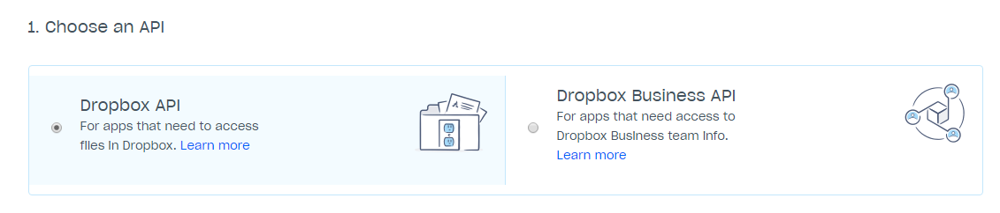
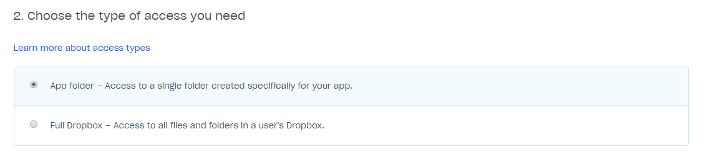
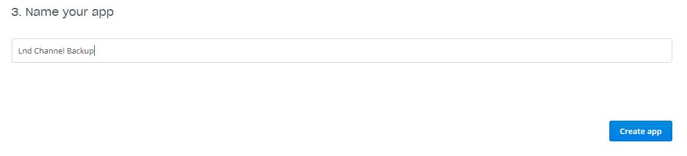
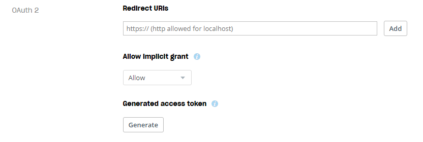

### Note: This README is still a work-in-progress!

# Reckless Channel State Backup Tool (for Lnd)

> The Lightning Network is amazing tech, but it's still very early days. We're literally building the ship around us while we're flying and so naturally some things aren't quite finished as yet. One of these things is *the ability to recover* from some sort of failure that might affect the state of the channels database. This is where this "reckless lnd backup" script comes in.


This is a simple script design for the `lnd` implementation of the Lightning Network specifications by Lightning Labs.

It is designed for a Linux environment, specifically the Raspbian Stretch distro running on a Raspberry Pi 3, but it should also work in any other Linux environment (with maybe minor tweaks).

## Purpose
**To make periodic backups that one can use to recover at least some funds from a failed node.**

The current failure mode for an lnd node is for the user to lose ***all*** funds currently locked into channels. This solution, while not perfect, seeks to provide at least some avenue for persons to recover funds.

## Setup

To get started, download the script:
```
$ cd && wget -qN https://raw.githubusercontent.com/vindard/lnd-backup/master/do-lndbackup.sh
$ sudo chmod +x do-lndbackup.sh
```

Run your first backup job:
```
$ sudo ./do-lndbackup.sh
```

This first backup creates the necessary directories and starts storing a state log and your first backup file locally at the hardcoded backup folder: `~/.lndbackup-<your-device-name>/`. The default settings for the script would create an unencrypted tar file of your `.lnd` folder and store it locally at this same backup folder.


### Setting up off-site backups
To be properly secure, backup files created should ideally be stored on a separate device from your node. To easily facilitate this, this script makes use of gpg encryption and Dropbox's cloud services to upload encrypted copies of your backups to their servers.

*Note: The script is designed to only allow **encrypted** versions of your backups to be uploaded to the cloud.*

* **Setting up gpg encryption**

    Your gpg key is what will be used to encrypt and decrypt the backup files generated. It can be stored on the node device but a backup copy of the key should also be made and stored elsewhere in the event of any hardware failure.

    1. Generate a GPG key pair

        `$ gpg --full-generate-key`

    2. At the prompt, press `Enter` to accept the default RSA and RSA

    3. Enter the desired key size. I recommend the maximum key size of `4096`

    4. Enter the length of time the key should be valid. Press `Enter` to specify the default selection, indicating that the key doesn't expire

    5. Verify that your selections are correct

    6. Enter your user ID information. Recommended: enter your email as `lndbackup@lightningnetwork.com` to make step 8. below easier

    7. Press `Enter` to leave the password prompts blank. Confirm that you would like to continue ***without*** password protection

    8. Get the fingerprint for your new gpg key

        `$ GPG_FGPT=$(gpg --fingerprint --keyid-format long pgp | grep fingerprint | grep -oP '.{19}$' | tr -d ' ' | tee /dev/tty)`

    9. Place the gpg fingerprint into the script

        `$ sed -i "s/GPG=\".*\"/GPG=\"$GPG_FGPT\"/" do-lndbackup.sh`

    **Backing up the gpg key:**

    10. Export the gpg private key to a file

        `$ gpg --output lndbackup-decrypt.pgp --armor --export-secret-key lndbackup@lightningnetwork.com`

    11. From another device (e.g. your laptop), copy the file via ssh (scp) from your node device

        `$ scp <user>@<ip>:lndbackup-decrypt.pgp .`

    **Decrypting a backup:**

    12. Optional, if the device was corrupted copy the private key back to your node device and import it

        ```
        $ scp lndbackup-decrypt.pgp <user>@<ip>:lndbackup-decrypt.pgp
        $ gpg --import lndbackup-decrypt.pgp
        ```
    13. Copy the backup file to the node device

        `$ scp <backup-file>.gpg <user>@<ip>:<backup-file>.gpg`

    14. Decrypt your encrypted backup file using the gpg key

        `$ gpg --decrypt <backup-file>.gpg > <backup-file>`

.

* **Dropbox API**
    
    In your web browser, do the following:
    
    1. Go to https://www.dropbox.com/developers/apps/create and sign in
    
    1. Choose **Dropbox Api**
    
        
    
    1. Choose **App Folder**
    
        
    
    1. Name your app and click **Create App** to proceed
    
        
    
    1. On the settings page for your new app, scroll down to **OAuth 2** and click **Generate**
    
        
    
    1. You will now see a string of letters and numbers appear. This is your **Api Token**. Copy this token and keep it safe for the next steps. This api token will be referenced as `<dropbox-api-token>` in the next step.
    
    1. Return to your terminal and run the following to insert the api token into the backup script:
    
        ```
        $ TOKEN=<dropbox-api-token>
        $ cd && sed -i "s/DROPBOX_APITOKEN=\".*\"/DROPBOX_APITOKEN=\"$TOKEN\"/" do-lndbackup.sh
        $ unset TOKEN
        ```

### Scheduling automatic backups

* [Steps to setup cron jobs]

```
0 */6 * * * /bin/bash -l /home/<your-home-folder>/lnd-data-backups/do-lndbackup.sh -s -m 12h
30 */2 * * * /bin/bash -l /home/<your-home-folder>/lnd-data-backups/do-lndbackup.sh
```
### (Optional) Understanding the different backup modes
* 'stopped' vs. 'inflight' backups
* state change monitoring and forced runs
* 'minimum time before force' runs

---
## Some background on "channel states"

`lnd` channels are "stateful". This means that your being able to draw balances and successfully participate in the network *depends* on you having the latest state of your channels. A channel's state is represented by...

## What this tool does

*[Explanation here]*

### Functionality Checklist

- [x] copy `.lnd` folder and package into tar file as backup
- [x] gpg encrypt tar file before upload
- [x] stop lnd (dump memory to disk), backup data, restart lnd
- [x] only run backup process if there are channel state changes
- [x] add flags/arguments to run in various modes from the command line (for CRON jobs)
- [x] refactor code to gracefully handle any missing variables/arguments
- [x] add a date checker to allow forced backup runs at set intervals

---

## Eventual plans

I started creating this tool with the intention of submitting it as a Pull Request to one of the Raspberry Pi `bitcoind + lnd` setup guides (RaspiBlitz, RaspiBolt guides). Once it is finished up to a level where I'm happy with the features/functionality I have planned, I'll be writing up and submitting those PRs for consideration.
